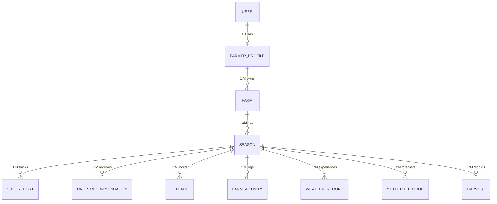

# AI Smart Farming Management System - Database Design

This document outlines the normalized relational database design for the Smart Farming Backend.

## High-Level Entity Relationship Architecture

The data flows strictly top-down to avoid circular dependencies. Every data point related to farm management is scoped to a specific `Season` to ensure historical data tracking (e.g., expenses for Kharif 2023 vs. Kharif 2024 are kept separate).

---

## Entity Schemas & Relationships

### 1. Core Hierarchy

**`User`**
*   **Attributes:** `id` (PK), `username`, `password_hash`, `email`, `role`, `created_at`
*   **Relationships:** Exactly one `FarmerProfile` (1:1).

**`FarmerProfile`**
*   **Attributes:** `id` (PK), `full_name`, `phone`, `address`
*   **Relationships:** Belongs to one `User` (FK: `user_id`, Unique). Can have multiple `Farm` records (1:M).

**`Farm`**
*   **Attributes:** `id` (PK), `name`, `location/coordinates`, `area_size_hectares`, `primary_soil_type`
*   **Relationships:** Belongs to one `FarmerProfile` (FK: `farmer_profile_id`). Can have multiple `Season` records (1:M).

**`Season`**
*   **Attributes:** `id` (PK), `season_name` (e.g., Kharif 2024), `start_date`, `expected_end_date`, `status` (Active, Completed)
*   **Relationships:** Belongs to one `Farm` (FK: `farm_id`). Acts as the central anchor for all activity and reporting modules (1:M for all modules below).

---

### 2. Season-Dependent Modules (All contain FK: `season_id`)

By anchoring these to `Season` rather than `Farm`, we prevent historical overlap and ensure Profit/Loss calculation per season is perfectly isolated.

**`SoilReport`**
*   **Attributes:** `id` (PK), `nitrogen`, `phosphorus`, `potassium`, `ph_level`, `moisture`, `test_date`
*   **Notes:** A season can have multiple reports over time to track soil health changes.

**`CropRecommendation`**
*   **Attributes:** `id` (PK), `recommended_crop`, `confidence_score`, `ai_model_version`, `created_at`
*   **Notes:** Stores the AI's suggestions based on the pre-season soil and weather data.

**`Expense`**
*   **Attributes:** `id` (PK), `category` (Seeds, Fertilizer, Labor, etc.), `amount`, `date`, `description`
*   **Notes:** Used alongside Harvest revenue to calculate `Profit Analysis`.

**`FarmActivity`**
*   **Attributes:** `id` (PK), `activity_type` (Sowing, Irrigation, Pesticide), `date`, `notes`
*   **Notes:** Daily log of actions taken during the season.

**`WeatherRecord`**
*   **Attributes:** `id` (PK), `date`, `temperature`, `humidity`, `rainfall_mm`, `advisory_notes`
*   **Notes:** Specific weather impacts logged against the season timeline.

**`YieldPrediction`**
*   **Attributes:** `id` (PK), `predicted_yield_tons`, `confidence_score`, `prediction_date`
*   **Notes:** AI-generated forecasts made throughout the season.

**`Harvest`**
*   **Attributes:** `id` (PK), `actual_yield_tons`, `harvest_date`, `quality_grade`, `revenue_generated`
*   **Notes:** The closing record of the season. Revenue here minus Expenses calculates overall Profit.

---

### Design Integrity Checks
*   **No Circular Dependencies:** Accessing any entity strictly follows the `User -> Profile -> Farm -> Season -> [Module]` path.
*   **No Unnecessary Duplication:** Weather and Soil are tied to the `Season` timeline rather than duplicating farm geographical data.
*   **Isolated Calculations:** Profit Analysis is derived dynamically from `Harvest.revenue_generated` minus `SUM(Expense.amount)` for a given `season_id`. No need for a redundant "Profit" table.
